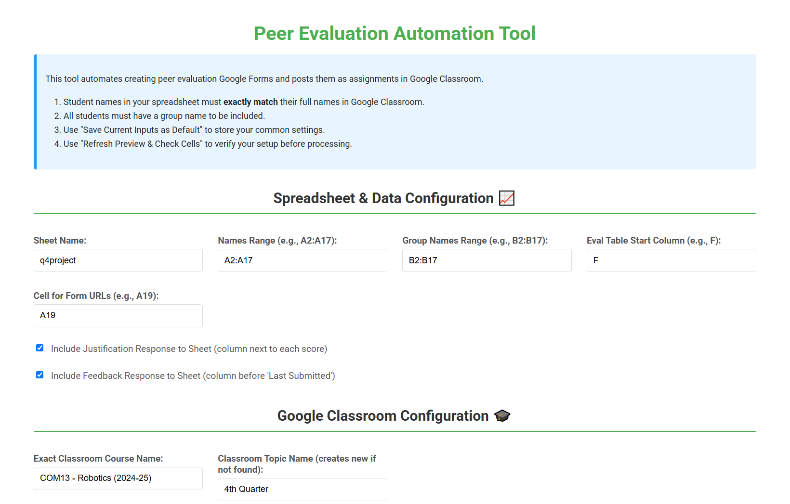
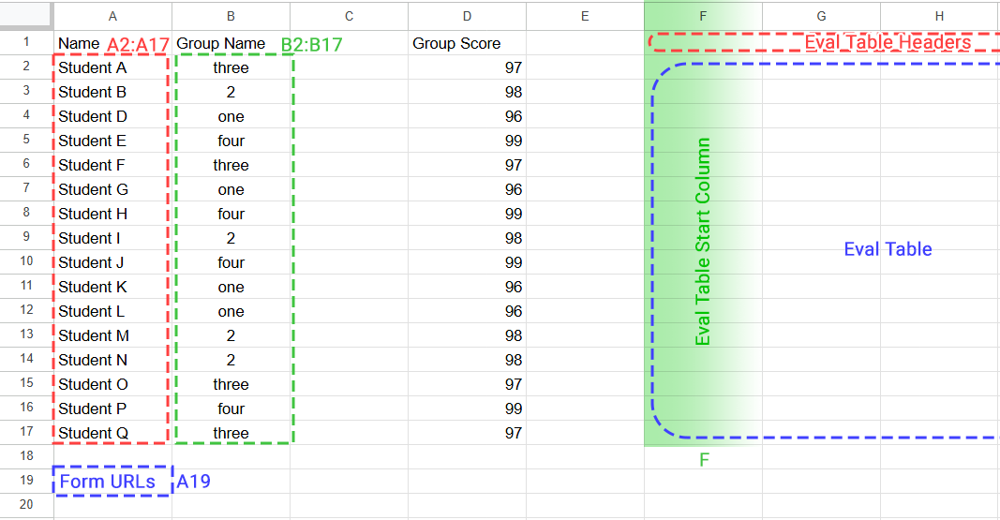
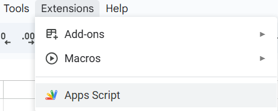
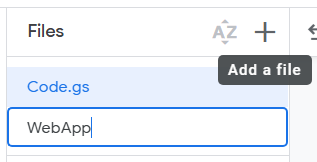
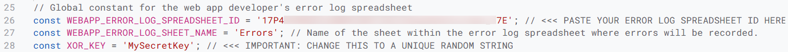
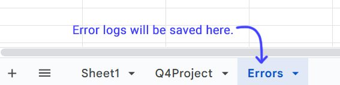
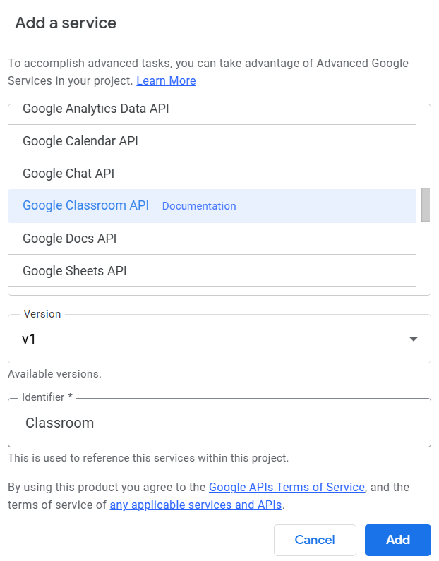
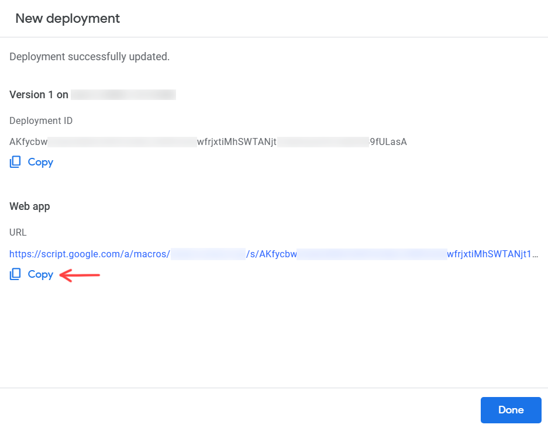
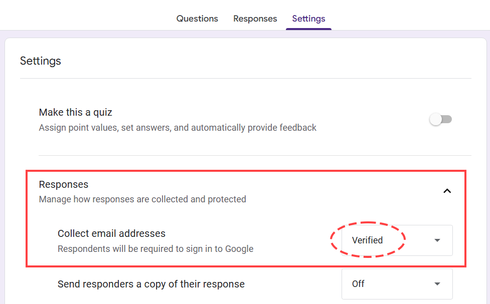
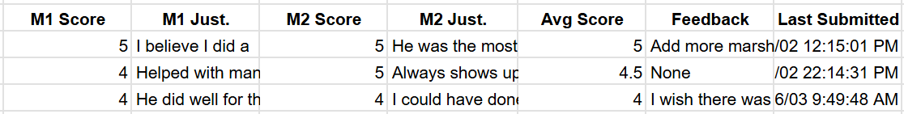

# Peer Evaluation Automation Tool

This tool automates the creation of peer evaluation Google Forms and Google Classroom assignments for group-based assessments. It is designed to simplify the process of generating evaluation forms, posting them as assignments in Google Classroom, and recording student responses in a Google Sheet. The tool features a straightforward web app interface, enabling users to set up and manage the process without prior coding knowledge.

## Overview

The Peer Evaluation Automation Tool uses Google Apps Script to:
- Read student names and group assignments from a Google Sheet.
- Create tailored Google Forms for each group, supporting peer and self-evaluation.
- Post assignments in Google Classroom, linking to the forms and assigning them to group members.
- Save form responses (scores, justifications, feedback) directly into the Google Sheet.
- Offer an easy-to-use web app for configuration and management.

## Key Features

- **Automated Form Creation**: Builds unique Google Forms for each group with adjustable rating scales.
- **Google Classroom Integration**: Posts assignments in Google Classroom, linking forms to specific students.
- **Spreadsheet Integration**: Pulls student and group data from a Google Sheet and records evaluation results.
- **Customizable Options**: Adjust rating scales, assignment details, due dates, and include optional justification or feedback fields.
- **Simple Web App**: Provides a clear interface with previews and checks to ensure proper setup.
- **Error Tracking**: Records issues in a separate Google Sheet for easy troubleshooting.
- **Trigger Management**: Allows viewing and deleting form submission triggers within the web app.

## Prerequisites

- A **Google Account** with access to Google Sheets, Google Forms, Google Drive, and Google Classroom.
- A **Google Sheet** listing student names and their group assignments.
- A **Google Classroom course** with enrolled students whose names exactly match those in the Google Sheet.
- A **Google Drive folder** to store the generated forms.

## Installation

### Step 1: Prepare the Google Sheet
1. Create a new Google Sheet or use an existing one.
2. Set up two columns:
   - **Student Names**: Full names that match exactly with Google Classroom (e.g., `A2:A17`). Tip: Click the preview button in the WebApp to have a list of students in the specified Classroom.
   - **Group Names**: The group each student belongs to (e.g., `B2:B17`).
3. Identify two settings for later:
   - **Evaluation Table Start Column**: The column where evaluation headers will begin (e.g., `F`).
   - **Form URLs Cell**: The cell where form links will be listed (e.g., `A19`).

### Step 2: Set Up the Apps Script Project
1. Open your Google Sheet.
2. Navigate to **Extensions > Apps Script**.  
   
3. In the Apps Script editor:
   - Replace the default code in `Code.gs` with the contents of `Code.js` from this repository.
   - Click the `+` icon next to "Files," choose **HTML**, name it `WebApp`, and paste the contents of `WebApp.html` from this repository.
   
4. Update these constants in `Code.js`:
   - **WEBAPP_ERROR_LOG_SPREADSHEET_ID**: Create a new Google Sheet or use an existing one for error logging, copy its ID from the URL (e.g., `https://docs.google.com/spreadsheets/d/SPREADSHEET_ID/edit`), and insert it here.
   - **WEBAPP_ERROR_LOG_SHEET_NAME**: Confirm a sheet named "Errors" exists in the error log spreadsheet (or adjust this constant to match your sheet name).
   - **XOR_KEY**: Change `'YourSecretKeyForXOR'` to a unique, random string (e.g., `MySecret123`). Keep this private as it secures form data.
   
   
5. Save by clicking on the save icon.

### Step 3: Enable the Google Classroom API
1. In the Apps Script editor, click the `+` icon next to "Services" on the left.
2. Select **Google Classroom API** and click **Add**.

### Step 4: Deploy the Web App
1. In the Apps Script editor, click **Deploy > New Deployment**.
2. Click on the gear icon and select **Web App** as the deployment type.
3. Configure:
   - **Execute as**: "Me (your_email@example.com)".
   - **Who has access**: "Only myself" (or "Anyone within your organization" if others need access).
4. Click **Deploy**.
5. Grant permissions:
   - Choose your Google account when prompted.
   - If you see "Google hasn’t verified this app," click **Advanced**, then **Go to [Your Project Name] (unsafe)**.
   - Click **Allow** to permit access to Sheets, Forms, Drive, and Classroom.
6. Copy the **Web App URL** shown after deployment.

## Usage

### Step 1: Open the Web App
1. Paste the Web App URL into your browser.
2. Sign in with your Google account if asked.

### Step 2: Enter Settings
Fill out these sections in the web app:
- **Spreadsheet & Data Configuration**:
  - **Sheet Name**: The name of your Google Sheet (e.g., "Q4Project").
  - **Names Range**: Cells with student names (e.g., `A2:A17`).
  - **Group Names Range**: Cells with group names (e.g., `B2:B17`).
  - **Eval Table Start Column**: Starting column for evaluation headers (e.g., `F`).
  - **Cell for Form URLs**: Cell for form links (e.g., `A19`).
  - Check boxes to add justification or feedback columns to the spreadsheet.
- **Google Classroom Configuration**:
  - **Exact Classroom Course Name**: The exact name of your Google Classroom course.
  - **Classroom Topic Name**: Topic for assignments (created if it doesn’t exist).
  - **Base Assignment Title**: Base title for assignments (group name is added).
  - **Common Assignment Description**: Description for all assignments.
  - **Due Date**, **Due Time**, **Your UTC Offset**: Deadline details (e.g., `+0800` for your timezone).
  - **Assignment Points**: Points for the assignment (0 for ungraded).
  - **Schedule Date** and **Schedule Time** (optional): When assignments are posted.
- **Form Details**:
  - **Drive Folder Name**: Folder in Google Drive for forms.
  - **Base Form Title**: Base title for forms (group name is added).
  - **Common Form Description**: Description for all forms.
  - **Scale Lower Bound** and **Scale Upper Bound**: Rating scale range (e.g., 1 to 5).
  - **Scale Lower Label** and **Scale Upper Label**: Labels for the scale (e.g., "Poor" to "Excellent").
  - Check **Allow response editing** if students can update their responses.

### Step 3: Check Your Setup
1. Click **Refresh Preview & Check Cells** to review your settings.
2. Look at the preview for:
   - Sample student names and groups.
   - Counts of students and unique groups.
   - Status of the evaluation table and URL cell.
   - Confirmation of the Drive folder and Classroom topic.
   - Any name mismatches between the Google Sheet and Classroom (these must be fixed).
   - Whether the due date and schedule are valid.
3. Fix any errors or warnings shown in red or yellow.

### Step 4: Generate Forms and Assignments
1. Optionally, check **Delete all existing triggers before creating new ones** to clear old triggers.
2. Click **Create Forms & Assignments**.
3. Wait a few minutes for the process to finish.
4. Review the status message for success or errors.
5. Check your Google Sheet to see form URLs in the specified cell (e.g., `A19`).
6. Verify in Google Classroom that assignments appear under the specified topic.

### Step 5: Set Up Forms
1. Open each Google Form from the Drive folder.
2. Go to **Settings > Responses** and set **Collect email addresses** to **Verified**. This links responses to student identities.

### Step 6: Gather Responses
1. Students complete the forms through Google Classroom assignments.
2. Responses automatically populate the Google Sheet’s evaluation table with:
   - Scores and justifications for each group member.
   - An average score per student (calculated automatically).
   - Optional feedback and submission timestamps.

### Step 7: Manage Triggers (Optional)
1. In the web app, click **Refresh Triggers List** to see active form triggers.
2. Select any triggers to remove and click **Delete Selected Triggers** to clean up unused triggers.
   - Deleting a trigger will stop populating the sheet's evaluation table for that form's responses.

## Spreadsheet Output

The evaluation table in your Google Sheet (starting at the specified column, e.g., `F`) includes:
- **Headers**: Columns for each group member’s score and justification (e.g., "M1 Score", "M1 Just.").
- **Avg Score**: An automatically calculated average score for each student.
- **Feedback** (if enabled): General feedback from students.
- **Last Submitted**: Timestamp of the latest submission.

## Troubleshooting

- **Web App Errors**: Review the preview section for error messages and correct issues like invalid cell ranges or name mismatches.
- **No Spreadsheet Data**: Confirm forms have "Collect email addresses" set to "Verified" and that `XOR_KEY` in `Code.js` hasn’t changed since form creation.
- **Classroom Problems**: Ensure the course name is exact and student names match between the Google Sheet and Classroom.
- **Error Details**: Check the error log spreadsheet (set in `WEBAPP_ERROR_LOG_SPREADSHEET_ID`) for specific issues during processing or submission.
- **Permission Issues**: If prompted, re-authorize the script by running a function (e.g., `doGet`) in the Apps Script editor.

## Important Notes

- **Name Matching**: Student names in the Google Sheet must exactly match those in Google Classroom for proper assignment and response recording.
- **XOR Key**: Do not alter `XOR_KEY` in `Code.js` after creating forms, as it will stop responses from being processed correctly. Keep it private.
- **Google Limits**: The tool is suitable for typical class sizes, but may encounter Google API limits with very large groups. Check the error log if problems occur.
- **Data Privacy**: Follow your institution’s policies for handling student data.

## Contributing

To improve or fix the tool:
1. Fork this repository.
2. Create a branch (`git checkout -b feature/YourFeature`).
3. Commit changes (`git commit -m 'Add YourFeature'`).
4. Push to the branch (`git push origin feature/YourFeature`).
5. Submit a pull request.

## License

This project uses the GNU Affero General Public License. See the [LICENSE](LICENSE) file for details.

## Acknowledgments

- Developed with Google Apps Script.
- Works with Google Sheets, Google Forms, Google Drive, and Google Classroom.
- Created to assist educators with peer evaluations.

For help, open an issue in this repository.
